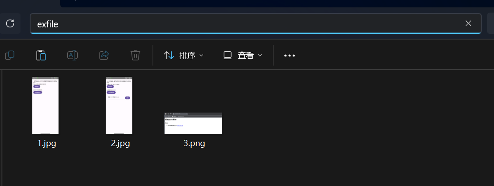
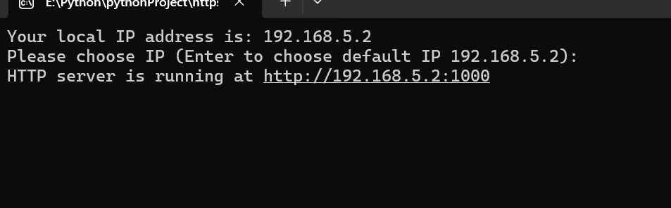
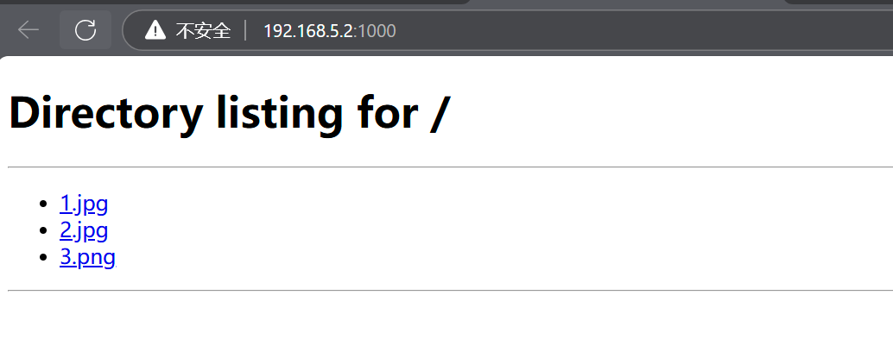
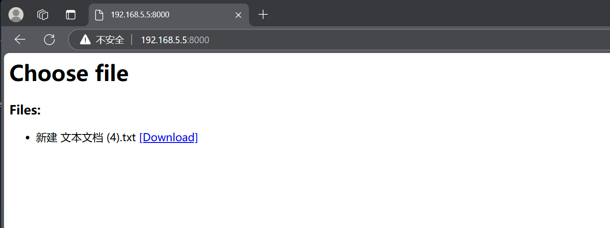

#    局域网文件传输助手
### 支持多种格式文件，操作简单，快速启动，不限速，支持一对多

├─exfile.exe (Windows端)       
└─局域网文件传输助手.apk  （Android端）

## windows端

第一步 在要传输文件对应目录启动exe即可（建议添加系统环境变量来快速启动）

第二部 输入IP或Enter选择默认IP（一般为默认，不确定可以在电脑网络设置里查看网络属性的IPv4）

第三步 局域网内PE或PC直接访问网址即可（点击文件即可下载）

## Android端
第一步 启动软件

第二步 选择文件

第三步 局域网内PE或PC直接访问网址即可

